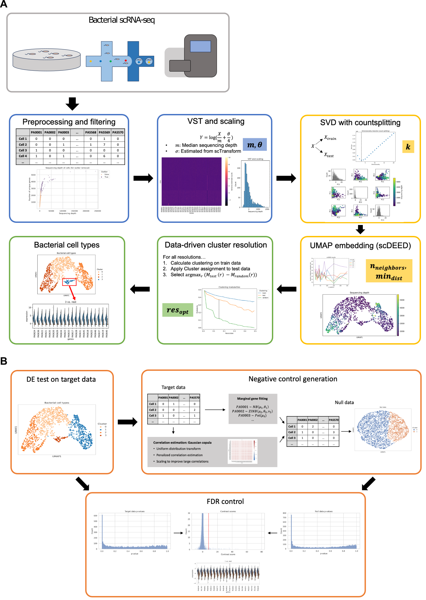

# BacSC: A general workflow for bacterial single-cell RNA sequencing data analysis

This repository contains the BacSC pipeline for bacterial single-cell sequencing data analysis (Ostner et al., 2024). 
It also contains all code needed to reproduce the analyses in the publication (TODO).

For usage info, please refer to the tutorials in the respective directory.

Raw and intermediate data objects can be downloaded on [zenodo](https://zenodo.org/records/12189002). 
Simply download the `data` directory from there and move it into the BacSC directory.

## Installation

## Usage

The `tutorials` directory contains two tutorial notebooks. 
The easiest way to use BacSC on your data is to copy these notebooks and replace the respective paths at the top of the notebooks.
  - `BacSC_tutorial_general_pipeline.ipynb` shows how to perform Variance stabilization, dimension reduction and clustering.
  - `BacSC_cluster_analysis_tutorial.ipynb` gives a template for differential expression testing with BacSC.

## Repository structure

This repository is structured as follows:

- The `tools` directory contains all functions and code used throughout the BacSC pipeline.
- The `tutorials` directory contains two tutorial notebooks. 
The easiest way to use BacSC on your data is to copy these notebooks and replace the respective paths at the top of the notebooks.
  - `BacSC_tutorial_general_pipeline.ipynb` shows how to perform Variance stabilization, dimension reduction and clustering.
  - `BacSC_cluster_analysis_tutorial.ipynb` gives a template for differential expression testing with BacSC.
- The `analysis` directory provides notebooks for reproduction of the results in the publication (TODO). 
Grouped by dataset source, there are 3 notebooks for each dataset:
  - `<dataset>_final_pipeline` (or `<dataset>_final_pipeline_2`) performs the general BacSC analsis up to cell type clustering.
  - `<dataset>_cluster_analysis` performs DA testing on the clusters determined before.
  - `<dataset>_summary_figures` generates the figures for each dataset in the manuscript.
